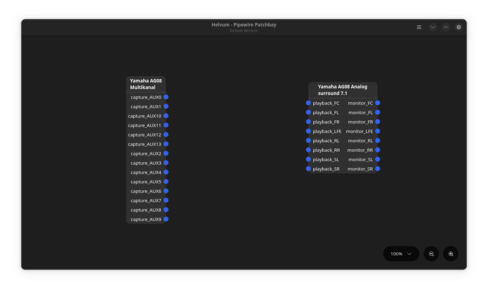

# 🎛️ Setup of Yamaha AG08 on Linux

A simple script to remap the PipeWire audio configuration for the **Yamaha AG08** audio interface on Linux.

This script adjusts the default channel mapping provided by PipeWire, changing:
- The **output** from 7.1 surround sound to **four stereo output channels**: `CH3/4`, `CH5/6`, `CH7/8`, and `AUX`
- The **input** from 14 multichannel inputs to:
  - Three stereo input channels: `Voice`, `Streaming`, and `AUX`
  - One 8-channel multichannel input: `DAW`

The script **automatically detects** when the AG08 is connected via USB and applies the custom remapping. When the device is disconnected, the configuration is automatically cleaned up.

## 🔑 Key features

- 🔁 **Remap** channels on the Yamaha AG08 audio interface
- ⚡ **Auto-remap** when the Yamaha AG08 is detected, and automatically remove remap when the device is disconnected

## 📦 Installation

```bash
curl -sSL https://raw.githubusercontent.com/chri11g6/Setup-Yamaha-AG08-on-linux/refs/tags/v0.0.1/install-ag08.sh | bash -s install
```

## 🧹 Uninstallation

```bash
curl -sSL https://raw.githubusercontent.com/chri11g6/Setup-Yamaha-AG08-on-linux/refs/tags/v0.0.1/install-ag08.sh | bash -s uninstall
```

## 🖼️ Screenshots

**Before remapping:**



**After remapping – Output:**


**After remapping – Input:**


## 🎚️ PipeWire Channel Remap — Output

| Channel Name            | Type   | PipeWire Channel |
|-------------------------|--------|------------------|
| CH3/4 (Yamaha AG08)     | Stereo | 3–4              |
| CH5/6 (Yamaha AG08)     | Stereo | 5–6              |
| CH7/8 (Yamaha AG08)     | Stereo | 7–8              |
| AUX (Yamaha AG08)       | Stereo | 9–10             |

| Original 7.1 Channel     | PipeWire Channel |
|--------------------------|------------------|
| playback_FL (Front Left) | 3                |
| playback_FR (Front Right)| 4                |
| playback_FC (Center)     | 5                |
| playback_LFE (Sub)       | 6                |
| playback_RL              | 7                |
| playback_RR              | 8                |
| playback_SL              | 9                |
| playback_SR              | 10               |

## 🎤 PipeWire Channel Remap — Input

| Channel Name            | Type         | PipeWire Channels |
|-------------------------|--------------|-------------------|
| Streaming (Yamaha AG08) | Stereo       | 0–1               |
| Voice (Yamaha AG08)     | Stereo       | 2–3               |
| AUX (Yamaha AG08)       | Stereo       | 4–5               |
| DAW (Yamaha AG08)       | 8-channel    | 6–13              |

| DAW Subchannels Mapping | Channel Numbers |
|-------------------------|-----------------|
| CH1                     | 6               |
| CH2                     | 7               |
| CH3/4                   | 8–9             |
| CH5/6                   | 10–11           |
| CH7/8                   | 12–13           |

## 🧪 Compatibility

- Tested with:
  - Yamaha AG08
  - PipeWire 1.0+
  - Linux distributions: `Kubuntu 24.10`

## 📄 License

MIT License. See `LICENSE` file for details.